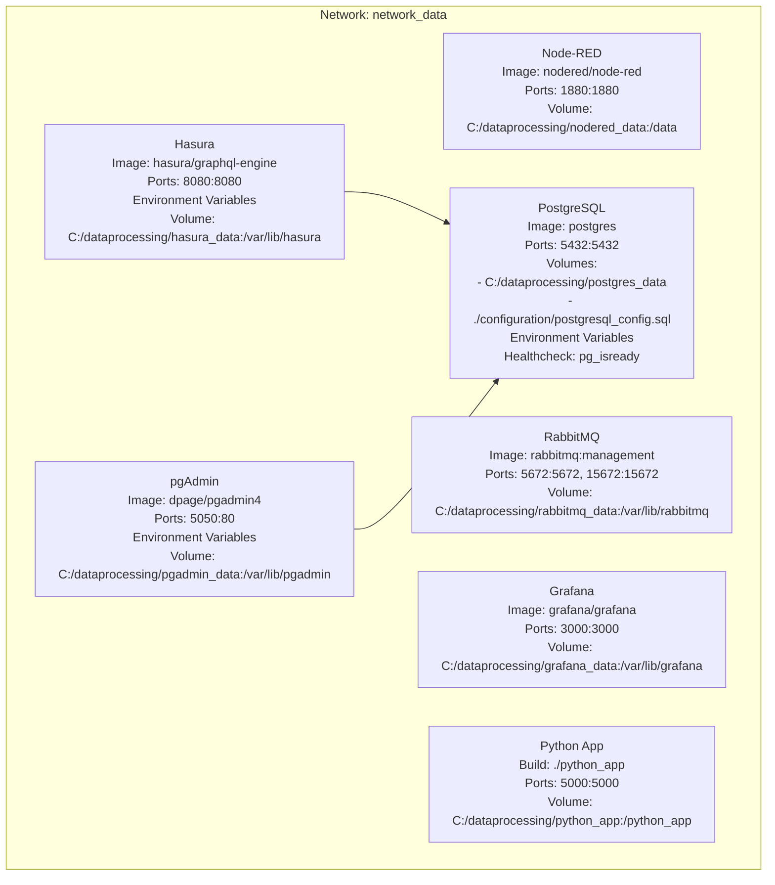

# Data processing example

## VS Code extensions used

[https://marketplace.visualstudio.com/items?itemName=ms-vscode-remote.remote-containers](https://marketplace.visualstudio.com/items?itemName=ms-vscode-remote.remote-containers)

## Overview

## In this docker build you have the follwoing:
- Node-RED runs on port 1880.
- RabbitMQ is accessible via ports 5672 (AMQP) and 15672 (management UI).
- Grafana runs on port 3000.
- PostgreSQL is set up with a user, password, and database.
- Hasura GraphQL Engine connects to the PostgreSQL database.
- pgAdmin is an administration tool for PostgreSQL

## To build the enviorement 
Open up the terminal and run the following command:
- Run docker-compose up -d 

- Cleanup MS Windows
  - Run docker-compose down
  - Remove-Item -Path "C:\dataprocessing" -Recurse -Force

- Cleanup Linux
  - Run docker-compose down
  - rm -rf /path/to/dataprocessing  

## Access the services:
Based on the usernames & passwords set in the .env file. 

If you change anyting please update the configuration/postgress_config.sql file also. 
- Node-RED: Open your browser and go to http://localhost:1880
- RabbitMQ Management UI: Visit http://localhost:15672 (login with guest/guest).
- Grafana: Access http://localhost:3000 (default login is admin/admin).
- Hasura GraphQL Engine: Go to http://localhost:8080
- pgAdmin: Go to http://localhost:5050  (admin@example.com / adminpassword) 
- Flask application: Go to http://localhost:5000 
